# Memory Forest

**A forest that grows from your Anki study history.** Every day you learn new
cards plants a tree below your deck list. Trees grow as those cards settle into memory,
and turn a little yellow when you start to forget them. There is nothing to click and
nothing to manage: just study, and watch it grow.

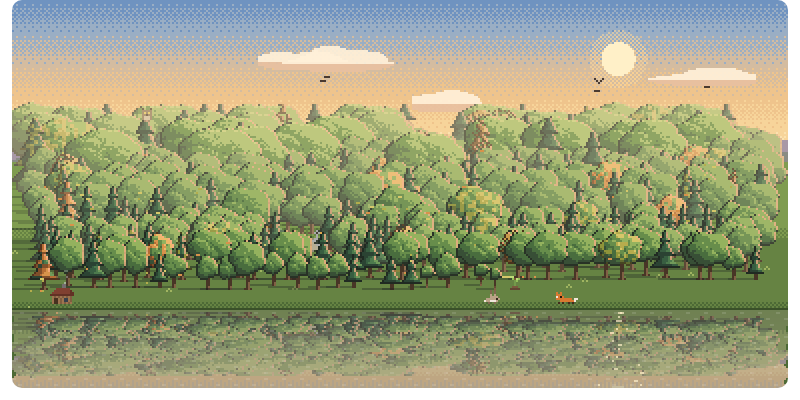

**[Get it on AnkiWeb](https://ankiweb.net/shared/info/1255432496)** · add-on code `1255432496`

## How it works

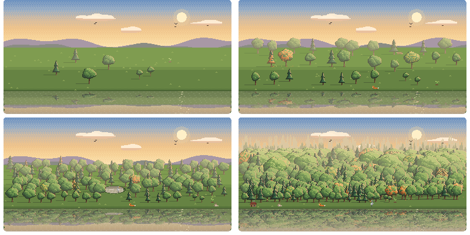 
<i>After a week, a month, four months and four years.</i>

Every day you learn new cards, a tree is planted. It starts as a seedling and grows as
you come to know those cards: within a few weeks it is a young tree, and the days you know
best keep growing for years, into ancient giants.
If you start forgetting a day's cards, its tree gets a few yellow leaves, and they turn
green again once you relearn them. Trees never die. Days when you only review don't plant a tree, but they keep the ones you have healthy.

So the forest is a picture of what you know: its size is how much you have learned, and
its colour is how well you remember it. Take a week off and a pond appears where the
missing days would be. Keep studying and animals move in, and after a year a little
cabin appears at the edge of the woods.

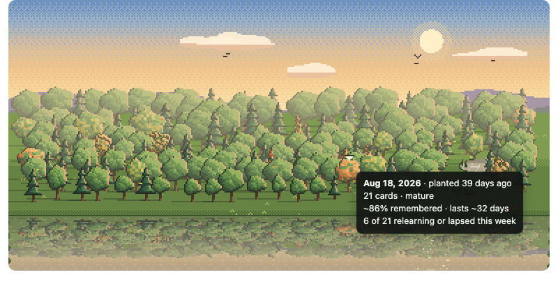 
<i>Point at any tree to see its day, and how well you remember it.</i>

## Pick your scenery

<table align="center">
  <tr>
    <td align="center">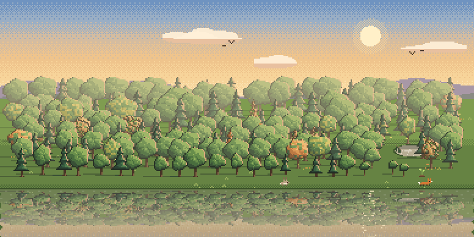 Golden hour by the lake</td>
    <td align="center">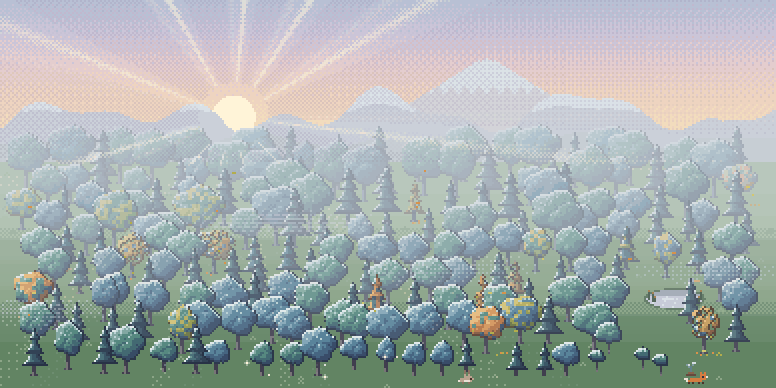 Misty mountain valley</td>
  </tr>
  <tr>
    <td align="center">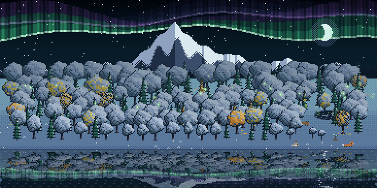 Aurora night</td>
    <td align="center">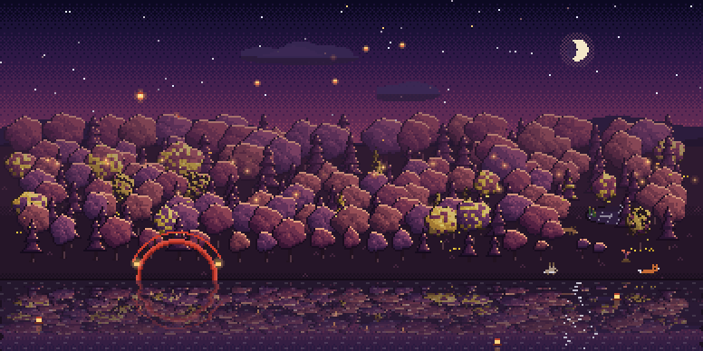 Lanterns at night</td>
  </tr>
  <tr>
    <td align="center">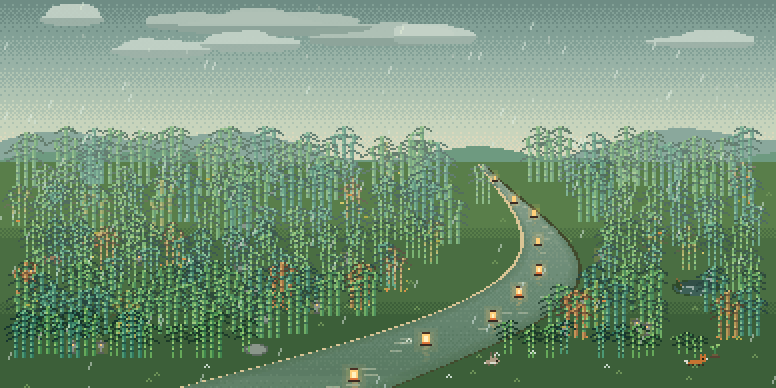 Rainy bamboo grove</td>
    <td align="center">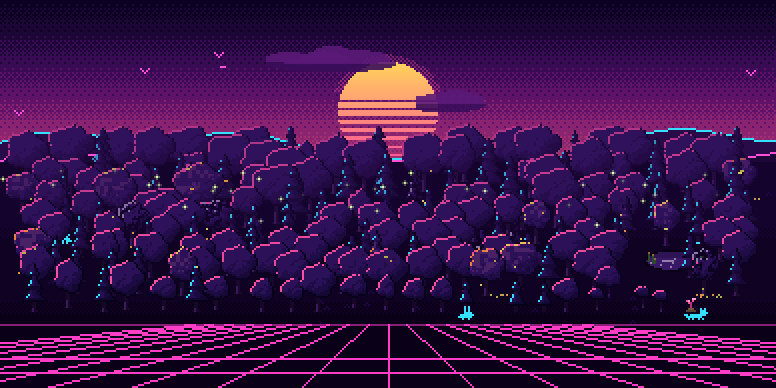 Synthwave</td>
  </tr>
</table>

## How you study

The forest notices how you study, not just what you learn. Good days leave something
behind for you to find. Whether bad habits leave a mark too is up to you: pick a
**Nature** on the General tab of the settings.

 
<b>Peaceful</b> (the default): only the good things. Days away cost you nothing.

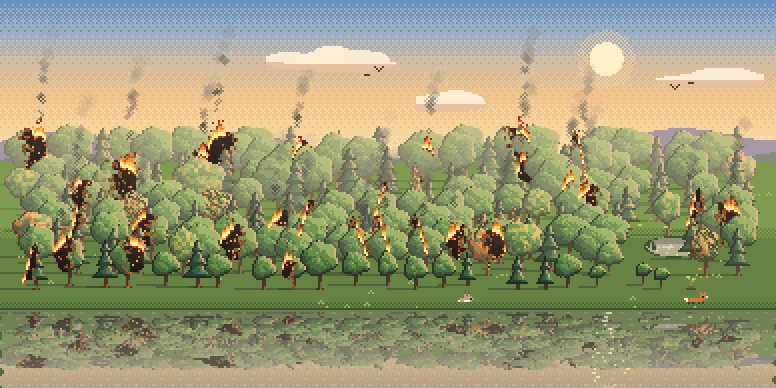 
<b>Wild</b>: bad habits leave marks until you fix them. Miss a day and smoke rises from the
forest as a warning; miss the next one too and a fire breaks out, spreading while you stay
away. A week of study puts it out.

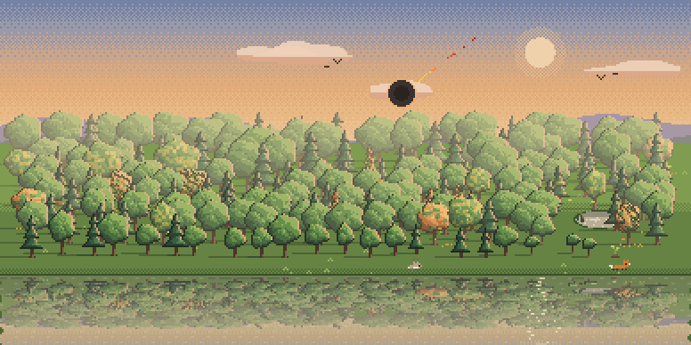 
<b>Merciless</b>: a single day without reviews brings down an asteroid on the whole forest,
and a new one grows from there. Bad habits leave their marks too.

Change your mind at any time: switch back and your forest is just as it was.

## On your phone

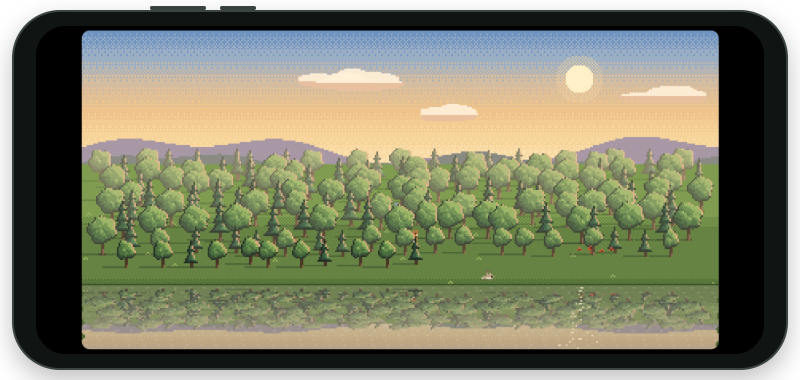

Turn on "Show my forest on my phone" on the General tab. After your next sync, a
Memory Forest deck appears in AnkiDroid: open it to see your forest.

Your computer draws this copy, so it updates whenever Anki syncs there.

## Compatibility and privacy

- Anki 2.1.50 or later, on a computer (Windows, macOS, Linux). AnkiDroid can show a copy
  of your forest that your computer sends it (see On your phone).
- Everything is computed on your computer from your own review history. The only thing
  that leaves it is your city's name, and only if you turn on the real weather: it is sent
  to [Open-Meteo](https://open-meteo.com) (free, no account) to look up the forecast. The
  copy of your forest for your phone goes through your own AnkiWeb sync, like any card.

## Support

If you enjoy Memory Forest, please [give it a thumbs up on AnkiWeb](https://ankiweb.net/shared/review/1255432496)
and share it with friends who study with Anki. It is what helps other people find it.

A new scenery arrives every month. Want each one first? [Join on Patreon](https://www.patreon.com/BarakLevy)
for Memory Forest Plus, and every scenery comes to this version later on.

## Feedback

Found a bug or have an idea? [Open an issue](https://github.com/baraklevy20/memory-forest/issues).

## License

[MIT](LICENSE). Developing it yourself? See [DEVELOPMENT.md](DEVELOPMENT.md).
